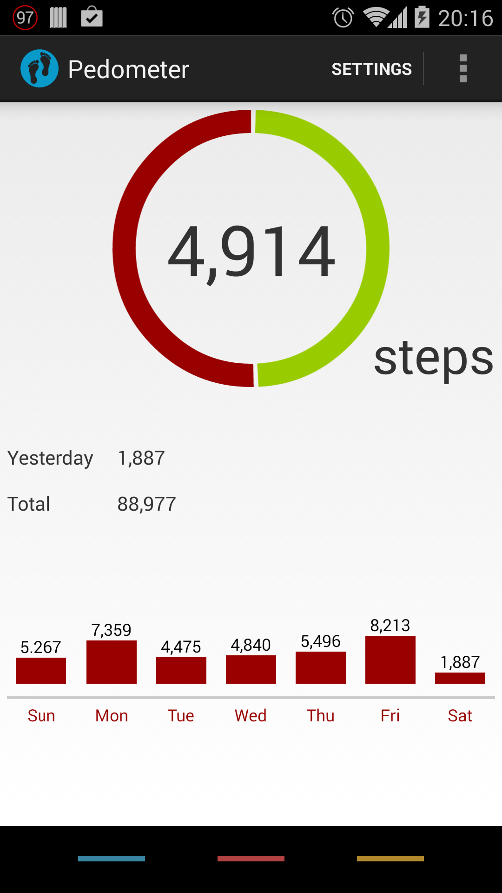
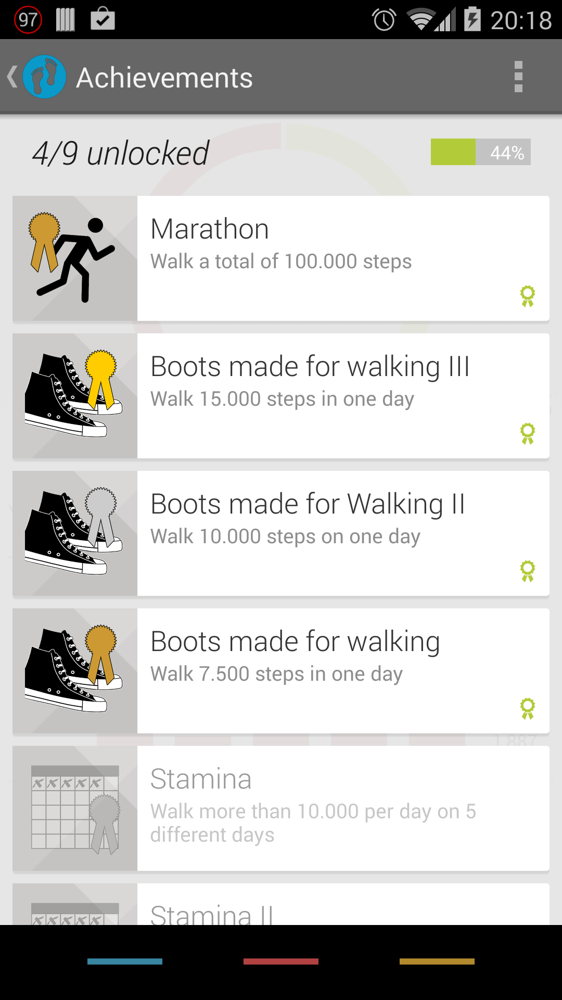

Pedometer
=========

Lightweight pedometer app using the <b>hardware step-sensor</b> for minimal battery consumption.
This app is designed to be kept running all the time without having any impact on your battery life! It uses the hardware step detection sensor of the Nexus 5, which is already running even when not using any pedometer app. Therefore the app does not drain any additional battery. Unlike other pedometer apps, this app does <b>not</b> track your movement or your location so it doesn't need to turn on your GPS sensor (again: <b>no impact on your battery</b>).

Sign in with your Google+ account to unlock <b>achievements</b> and keep you motivated!

Pedometer uses the [EazeGraphLibrary](https://github.com/blackfizz/EazeGraph "EazeGraphLibrary") by Paul Cech and [a fork](https://github.com/j4velin/colorpicker) of [ColorPickerPreference](https://github.com/attenzione/android-ColorPickerPreference "android-ColorPickerPreference: Android color picking library") by Sergey Margaritov.

<table sytle="border: 0px;">
<tr>
<td></td>
<td></td>
</tr>
</table>

