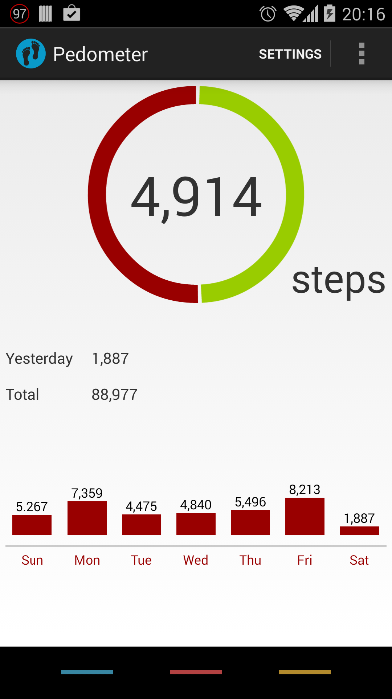
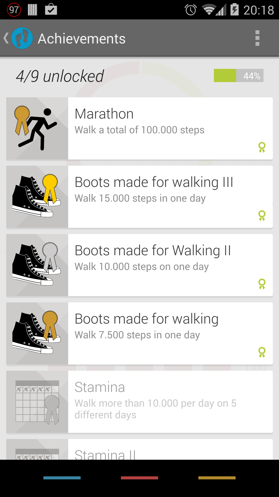

Pedometer
=========

Lightweight pedometer app using the <b>hardware step-sensor</b> for minimal battery consumption.
This app is designed to be kept running all the time without having any impact on your battery life! It uses the hardware step detection sensor of the Nexus 5, which is already running even when not using any pedometer app. Therefore the app does not drain any additional battery. Unlike other pedometer apps, this app does <b>not</b> track your movement or your location so it doesn't need to turn on your GPS sensor (again: <b>no impact on your battery</b>).

Sign in with your Google account to unlock <b>achievements</b> and keep you motivated!


<table sytle="border: 0px;">
<tr>
<td></td>
<td></td>
</tr>
</table>

<a href="https://play.google.com/store/apps/details?id=de.j4velin.pedometer">
  
</a>
<a href="https://f-droid.org/repository/browse/?fdid=de.j4velin.pedometer&fdpage=35">
  
</a>

Building
--------

The app is written in Kotlin with a Jetpack Compose UI. Building it needs the Android SDK with
platform 37, set as `sdk.dir` in `local.properties` or as `ANDROID_HOME`. Gradle downloads the
JDK 21 toolchain by itself if there is none.

There are two flavors:

* `fdroid` has no Google dependencies.
* `play` adds achievements and leaderboards with Play Games. It needs
  `src/play/res/values/games-ids.xml` with `app_id` and the achievement and leaderboard IDs, as
  exported from the Play Console. The file is not part of the repository.

```
./gradlew assembleFdroidDebug                            # or assemblePlayDebug
./gradlew testFdroidDebugUnitTest testPlayDebugUnitTest  # unit and Robolectric tests
./gradlew lintFdroidDebug lintPlayDebug
```

Releasing
---------

1. Raise `versionCode` and `versionName` in `build.gradle.kts`. The version code is
   major × 1000 + minor × 100 + patch, so 2.0.0 is 2000.
2. Copy `key.properties.sample` to `key.properties` and point it at the release keystore.
   Without it, or if its keystore is missing, the build warns and signs with the sample
   keystore in the repository.
3. `./gradlew assembleRelease` builds both flavors, minified with R8, to
   `build/outputs/apk/<flavor>/release/`.
4. Install the release APK over the previous version on a device and check that the history
   and today's steps are still there.
